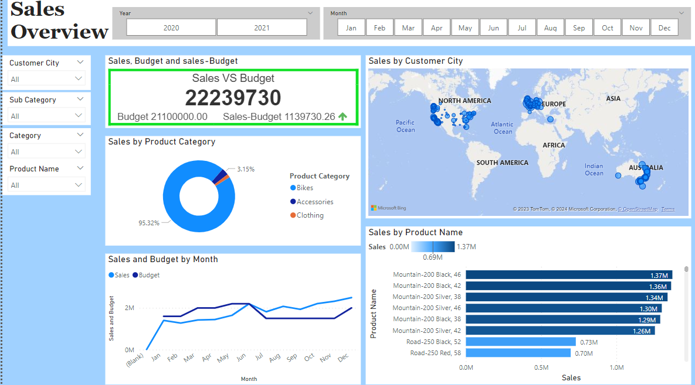

## Sales Management Analysis

### Introduction:

I conducted an Exploratory Data Analysis on online sales of a store. This project involved examining and analyzing the dataset using SQL to extract valuable insights and trends related to Total revenue, Total Orders, Average revenue per order, order time, monthly and daily sales analysis and more. The EDA aimed to uncover patterns and correlations within the data, providing a foundation for data-driven decision-making. It will help the owner understand the sales, profits/losses for products, most sold products,  and much more to make better decisions and be well-prepared for the business.

The analysis done can be summarized below:
The sales dashboard gives an overall summary of sales based on customers and products.
The customers dashboard gives the sales based on customers.
The products dashboard gives the sales based on products.

Dataset Link: https://github.com/Swapppyy/Data-Analysis-of-Pizza-Sales

### My Insights:

- Overall sales and budget for 2020 and 2021.

- There was a profit in 2020 whereas loss in 2021.

- Most sold product and the best customers.

- Bikes contribute 95.32% of the overall sales for the term 2020-2021.

- Customers are spread globally across the USA, Australia and Europe.

 
 

### Glimpse of my Dashboard:

  

 
 

  

 
 

  

 
 

    
